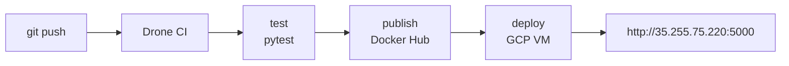

# devops-pipeline

A full CI/CD pipeline demo: Flask app → automated tests → Docker Hub publish → auto-deploy to GCP VM.

## Architecture



## Local dev

```bash
pip install -r requirements.txt
python app.py
```

App runs at `http://localhost:5000`.

## Run tests

```bash
pytest tests/
```

## Docker

```bash
# Build
docker build -t devops-pipeline .

# Run
docker run -p 5000:5000 -e APP_ENV=development devops-pipeline
```

## CI/CD secrets setup

Add these in the Drone UI under repository → Settings → Secrets:

| Secret | Value |
|---|---|
| `DOCKER_USERNAME` | Your Docker Hub username |
| `DOCKER_PASSWORD` | Docker Hub access token |
| `SSH_KEY` | Private key for SSH access to GCP VM |

To generate the deploy SSH keypair and authorize it on the VM:

```bash
ssh-keygen -t ed25519 -C "drone-deploy" -f ~/.ssh/drone_deploy -N ""
ssh ubuntu@35.255.75.220 "echo '$(cat ~/.ssh/drone_deploy.pub)' >> ~/.ssh/authorized_keys"
```

Then add the contents of `~/.ssh/drone_deploy` as the `SSH_KEY` secret in Drone.

## Endpoints

| Method | Path | Example response |
|---|---|---|
| `GET` | `/` | `{"status":"ok","message":"DevOps Pipeline Live"}` |
| `GET` | `/health` | `{"status":"healthy","env":"production"}` |
